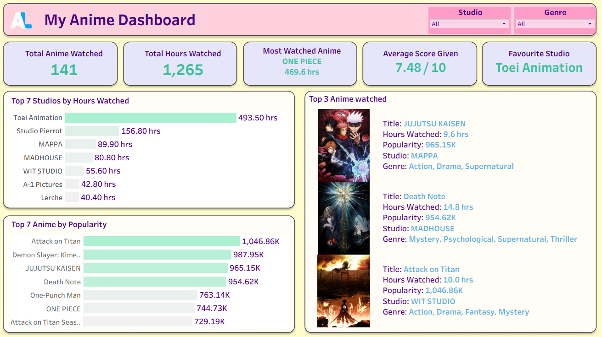

# 🎌 My Anime Dashboard

[](https://public.tableau.com/app/profile/kartik.sharma1671/viz/MyAnimeDashboard/Dashboard1)
[](https://www.python.org/)
[](https://www.figma.com/)
[](https://anilist.gitbook.io/anilist-apiv2-docs/)

## 📖 Project Summary

My Anime Dashboard is a Tableau project that visualizes anime watch data pulled from AniList.  
The repository contains a Python data-refresh script plus dashboard assets so the visual can be updated consistently over time.

## 🖼️ Demo / Preview



- Live dashboard: [View on Tableau Public](https://public.tableau.com/app/profile/kartik.sharma1671/viz/MyAnimeDashboard/Dashboard1)

## 📊 Key Features

- KPI-focused overview (total watched, hours watched, average score, favorite studio, most watched anime)
- Visual ranking views (top studios by hours, top anime by popularity, top watched anime table)
- Interactive filtering by studio and genre
- Weekly-friendly refresh flow from AniList API to CSV to Tableau

## ⚙️ Data Workflow

1. Fetch AniList data with `Anilist_data.py` using AniList GraphQL.
2. Transform and save results to `anilist_list.csv`.
3. Open `MyAnimeDashboard.twbx` and refresh the CSV data source in Tableau.
4. Publish updates to Tableau Public (optional) after validation.

## 🧰 Setup (Local)

### Prerequisites

- Python 3.13+
- A registered AniList app (for `client_id` and `client_secret`)
- Tableau Desktop (or Tableau Public desktop app) to refresh the workbook

### Required local files

- `Anilist_data.py` (already in this repo)
- `tokens.json` (generated/managed locally for OAuth refresh flow)
- `anilist_list.csv` (generated by the script)

### Configure credentials

In `/home/runner/work/My-Anime-Dashboard/My-Anime-Dashboard/Anilist_data.py`, set:

- `CLIENT_ID`
- `CLIENT_SECRET`
- `USERNAME`

## ▶️ Usage / Update Process

1. Ensure credentials are set in `Anilist_data.py`.
2. Run the refresh script:
   ```bash
   python Anilist_data.py
   ```
3. Confirm that `anilist_list.csv` is updated with latest entries.
4. Open `MyAnimeDashboard.twbx` in Tableau and refresh the data source.
5. Re-publish dashboard updates to Tableau Public if desired.

## 🔐 Security & Config Notes

- Do **not** commit secrets (`CLIENT_ID`, `CLIENT_SECRET`, access tokens, refresh tokens).
- Keep `tokens.json` local-only since it contains sensitive OAuth tokens.
- Treat generated CSV and token artifacts as environment-specific files unless intentionally sharing sanitized sample data.

## 🛠️ Tech Stack

- Python (data fetch + CSV export)
- AniList GraphQL API (source data)
- Tableau (analysis and dashboarding)
- Figma (dashboard background design)

## 🌐 Links

- 📊 Tableau Dashboard: [My Anime Dashboard](https://public.tableau.com/app/profile/kartik.sharma1671/viz/MyAnimeDashboard/Dashboard1)
- 🎨 Figma Design: [Anime Dashboard BG](https://www.figma.com/design/bJR4jMPRqJSF4xdwxdVnse/Anime-Dashboard-BG?node-id=3-5&t=E2gnXfjUTos2StPp-1)
- 💻 GitHub Repo: [sh-kartik18/My-Anime-Dashboard](https://github.com/sh-kartik18/My-Anime-Dashboard)
- 🔗 AniList Profile: [Kartikk18](https://anilist.co/user/Kartikk18/)

## 📬 Contact

[](https://github.com/sh-kartik18)
[](https://www.linkedin.com/in/sh-kartik/)
[](mailto:kartiksharma17022004@gmail.com)

## ⭐ Support

If this project helped you, please consider starring the repository.
