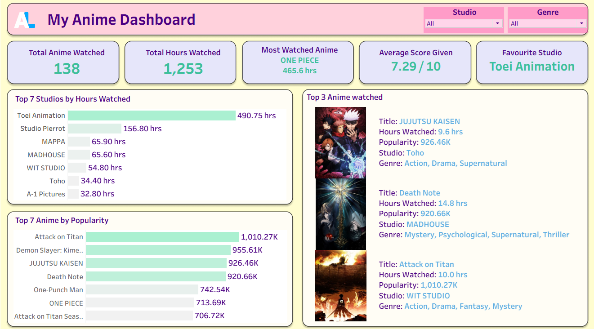

# 🎌 My Anime Dashboard  

 
 
 
 

---

## 📖 Project Overview  
This project is an **interactive Tableau Dashboard** that visualizes my anime journey using data from [AniList](https://anilist.co/).  
The workflow automatically fetches anime data weekly and updates the dashboard with key insights, KPIs, and visual storytelling.  

---

## ⚙️ Workflow  

1. **Data Scraping (AniList API)**  
   - Fetched anime details: *title, episodes, progress, studio, genres, status, average score, popularity, score, watch status, start/end date, cover image*.  

2. **Automation with Python**  
   - Script to fetch & update data into a CSV file.  
   - Scheduled using **Task Scheduler** (runs weekly).  

3. **Tableau Pre-Processing**  
   - Connected CSV to Tableau.  
   - Cleaned & transformed fields for analysis.  

4. **Dashboard Design**  
   - Custom background designed in **Figma**.  
   - Built an interactive Tableau dashboard.  

---

## 📊 Features  

### 🔑 KPIs  
- **Total Anime Watched**  
- **Total Hours Watched**  
- **Most Watched Anime**  
- **Average Score Given**  
- **Favourite Studio**  

### 📈 Visualizations  
- Top 7 **Studios by Hours Watched** (Bar Chart)  
- Top 7 **Anime by Popularity** (Bar Chart)  
- **Top 3 Anime Watched Table** (Cover image, title, studio, hours watched, popularity, genre)  

### 🎛 Parameters  
- **Filter by Studio**  
- **Filter by Genre**  

---

## 🖼️ Dashboard Preview  

  

---

## 🛠️ Tech Stack  

- **Python** → Data scraping & automation  
- **AniList API** → Source of anime data  
- **Task Scheduler** → Auto updates CSV weekly  
- **Tableau** → Data visualization & dashboard  
- **Figma** → Custom background design  

---

## 🔮 Future Enhancements  

- Add **anime recommendations** based on watch history.  
- Perform **time-series analysis** of watch patterns by year/month.  
- Create a **genre heatmap** for watch preferences.  
- Enable **live API connection** to Tableau (instead of weekly CSV).  
- Add **word clouds** of genres/tags for quick insights.  
- Build a **mobile-friendly dashboard** version.  

---

## 🙌 Acknowledgements  

- [AniList API](https://anilist.gitbook.io/anilist-apiv2-docs/) for providing detailed anime data.  
- [Tableau Public](https://public.tableau.com/) for dashboard publishing.  
- [Figma](https://www.figma.com/) for the custom dashboard background.  
- Community tutorials & docs that helped in **API + Tableau integration**.  

---

## 🌐 Links  

- 📊 **Tableau Dashboard** → [View on Tableau Public](https://public.tableau.com/app/profile/kartik.sharma1671/viz/MyAnimeDashboard/Dashboard1)  
- 🎨 **Figma Design** → [Open in Figma](https://www.figma.com/design/bJR4jMPRqJSF4xdwxdVnse/Anime-Dashboard-BG?node-id=3-5&t=E2gnXfjUTos2StPp-1)  
- 💻 **GitHub Repository** → [My Anime Dashboard](https://github.com/sh-kartik18/My-Anime-Dashboard)  
- 🔗 **AniList Profile** → [View My AniList](https://anilist.co/user/Kartikk18/)  

---

## 📬 Contact  

If you liked this project or have suggestions, feel free to connect with me:  

 
 
  

---

## ⭐ Support  

If you found this project useful:  
- Leave a **star ⭐** on the repo  
- Share it with fellow anime & data viz fans!  

Thanks for checking out **My Anime Dashboard**! 🎉  
